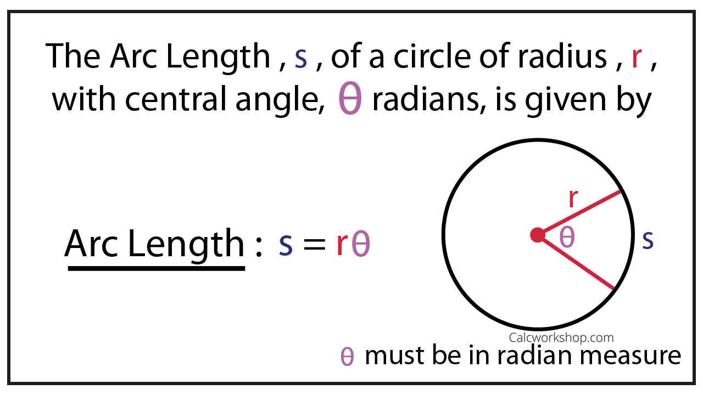

# Trail Follower

Implement a more precised distance control to follow the trapezoidal trail in the lab.
Use the encoders to sense and adjust your robot's pose (position and orientation).

## Requirements

### (30%) 1. Plan Trajectories

#### (10%) 1.1. Encoder Guided Linear Motion

Assume your robot will drive **straight** forward for a desired distance, $d$.
The encoder counts, $C$, on both motors will increase to a targeted value, synchronously.
Please write down an equation for calculating the target encoder counts $C$, given the desired linear travel distance, $d$.
You can use following definitions in your equation:

- Wheel radius: $r$
- Gear ratio: $i$
- Encoder's counts per revolution: $CPR$

> Write down linear motion equation below.

> [!TIP]
> If other quantities than the listed ones are needed.
> Please introduce them in math language.

#### (20%) 1.2. Encoder Guided Angular Motion

Assume your robot will spin around the center of the wheel axle for a desired angle, $\theta$.
The encoder counts on left motor, $C_l$, and the encoder counts on right motor $C_r$, will change synchronously, but in opposite directions.
Please write down one equation or two for calculating the targeted encoder counts, $C_l$ and $C_r$, given the desired spinning angle, $\theta$.
You can use following definitions in your equation:

- Wheel axle length: $L$
- Wheel radius: $r$
- Gear ratio: $i$
- Encoder's counts per revolution: $CPR$

> Write down angular motion equation(s) below.

> [!TIP]
> You may find the calculation of arc length as illustrated below helpful.
> **Be careful, the symbols used in graph are different from our definitions.**
> 

### 2. (70%) Coding

> [!IMPORTANT]
>
> - Please use math from [Plan Trajectories](#30-1-plan-trajectories) to code your robot.
Hard coding linear and angular maneuver by time is prohibited.
> - At each checkpoint, the distance from your robot's wheel axle center to the checkpoint will be recorded.
1% will be taken off for every 1 cm off the checkpoint.
> - If the robot is not travelling in straight lines, the distance of the furthest location from the trail will be recorded.
1% will be taken off for every 1 cm off the trail.
> - Please demo your robot to Dr. Zhang to redeem the credits.

- Start your robot with the wheel axle center at `Start/End/Checkpoint 4` and facing towards `Checkpoint 1`.
- Complete and run [trail_following.py](trail_following.py) to drive your robot along the trapezoidal trail and visiting `Checkpoint 1`, `Checkpoint 2`, `Checkpoint 3` and `Checkpoint 4` in order.
- Perform the following movements in sequence.
   1. (10%) Drive the robot **straightly** forward towards `Checkpoint 1`.
   Stop the robot at the `Checkpoint 1` for 3 seconds.
   2. (10%) Spin the robot around the axle center **counter-clockwisely**.
   Stop the robot when it is heading towards `Checkpoint 2` for 1 second.
   3. (10%) Drive the robot **straightly** forward towards `Checkpoint 2`.
   Stop the robot at the `Checkpoint 2` for 3 seconds.
   4. (10%) Spin the robot around the axle center **clockwisely**.
   Stop the robot when it is heading towards `Checkpoint 3` for 1 second.
   5. (10%) Drive the robot **straightly** forward towards `Checkpoint 3`.
   Stop the robot at the `Checkpoint 3` for 3 seconds.
   6. (10%) Spin the robot around the axle center **counter-clockwisely**.
   Stop the robot when it is heading towards `Checkpoint 4` for 1 second.
   7. (10%) Drive the robot **straightly** forward towards `Checkpoint 4`.
   Stop the robot at the `Checkpoint 4` and shutdown.

> [!TIP]
>
> - You may want to upload [encoded_motor_driver.py](https://github.com/linzhangUCA/3421example-motor_control/blob/main/encoded_motor_driver.py) to your Pico, so that you can get the encoder counts.
> - Synchronize left and right motor velocity is the key to drive your robot **straight**.
> - Define functions using the math from [Plan Trajectories](#30-1-plan-trajectories) to calculate target encoder counts from desired distance/angle.
