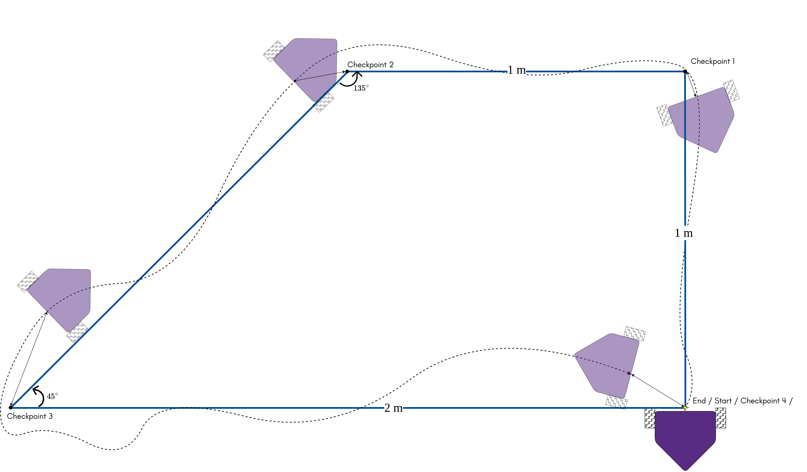
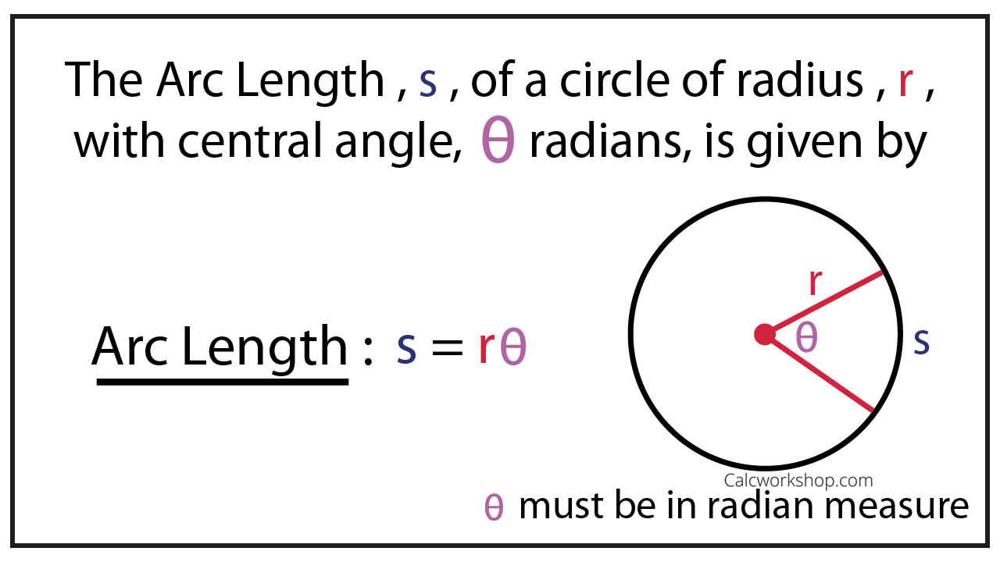

# Trail Follower
Implement a more precised motion control to follow the taped trapezoid on the ground. Use the encoders to sense and adjust your robot's pose (position and orientation). 

## Requiements:
### 1 (80%) Complete [`trail_follow.py`](trail_follow.py) in this repository. 
**Please upload all customized python module or template scripts (e.g. `sensored_motor_driver.py`)**

   Initially, place the robot's driving wheel axle center (**AC**) right on top of the starting point (`checkpoint 4`). Align the robot's heading direction to point `checkpoint 1` 
   1. (15%) Let the robot follow the trail from `checkpoint 4` to `checkpoint 1`. Based on the encoder feedback and calculation, stop the robot when **AC** is less than 0.05 m to the `checkpoint 1` (**the closer the better**). 
   2. (5%) Measure and log the distance from **AC** to the `checkpoint 1` here:  
   3. (15%) Resume driving, let the robot follow the trail from `checkpoint 1` to `checkpoint 2`. Based on the encoder feedback and calculation, stop the robot when **AC** is less than 0.1 m to the `checkpoint 2` (**the closer the better**). 
   4. (5%) Measure and log the distance from **AC** to the `checkpoint 2` here:  
   5. (15%) Resume driving, let the robot follow the trail from `checkpoint 2` to `checkpoint 3`. Based on the encoder feedback and calculation, stop the robot when **AC** is less than 0.15 m to the `checkpoint 3` (**the closer the better**). 
   6. (5%) Measure and log the distance from **AC** to the `checkpoint 3` here:  
   7. (15%) Resume the driving, let the robot follow the trail from `checkpoint 3` to `checkpoint 4`. Based on the encoder feedback and calculation, stop the robot when **AC** is less than 0.2 m to the `checkpoint 4` (**the closer the better**). 
   8. (5%) Measure and log the distance from **AC** to the `checkpoint 4` here:  
   
> Hint:
> 1. Wanna drive your robot straight? Read encoder counts on both motors and compare them to regulate motors' on/off states.
> 2. Turn at a certain angle: $s = r \cdot \theta$, where $s$ is the arc length in **meters**, $r$ is half of the wheel separation distance in **meters**, $\theta$ is the turning angle in **radians**.

### 2 (20%) Upload a video which records the entire navigation process. 
You'll want to modify lines in your [code](trail_follow.py) to reduce the stop time on each checkpoint. 

